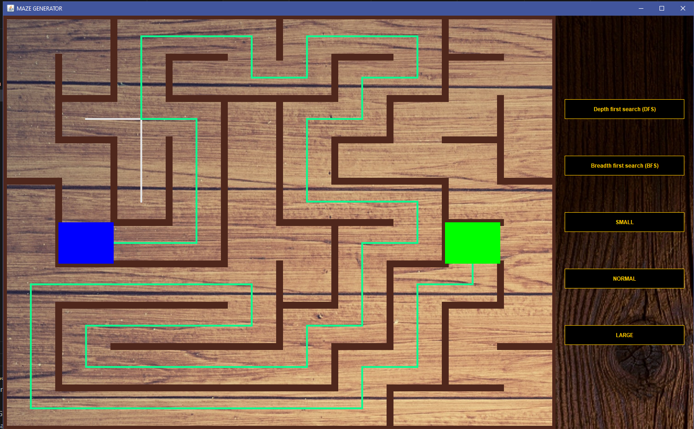
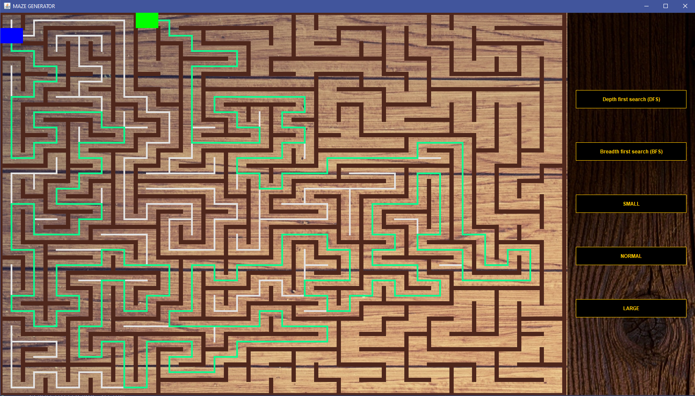
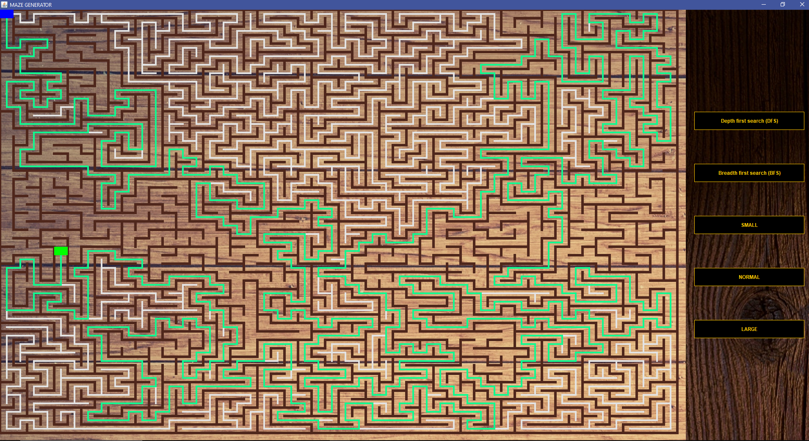

MAZE-GENERATOR

This project provides a visual representation of Depth-First Search (DFS) and Breadth-First Search (BFS), two commonly used graph traversal algorithms. The main goal of this project was to showcase my understanding of graphs and their traversal by creating my own graph data structure.

I started by researching general concepts online and stumbled upon maze generation using DFS. After reading a brief overview, I decided to implement everything from scratch, referring to external resources only when encountering challenges.

Purpose:

The primary purpose of this program is to provide a visual demonstration of DFS and BFS algorithms. Additionally, it showcases how DFS can be utilized to generate a randomized perfect maze.

Features:

Visualization of DFS and BFS graph traversal algorithms

Generation of randomized perfect maze using DFS

Acknowledgements
I would like to acknowledge the following resources that helped me during the development of this project:

Resource 1:https://www.baeldung.com/cs/maze-generation

Resource 2:https://makeschool.org/mediabook/oa/tutorials/trees-and-mazes/generating-a-maze-with-dfs/
